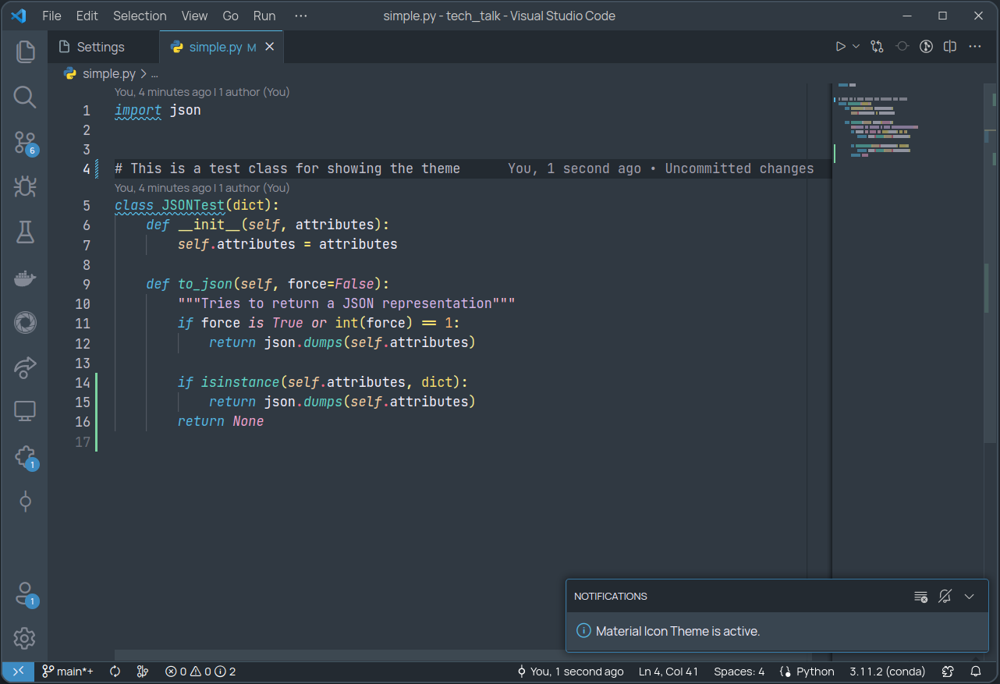

<h3 align="center">
	<br/>
	SērāMūriana color theme for <a href="https://code.visualstudio.com/">Visual Studio Code</a>
</h3>



## Description

My personal vscode color theme inspired by Sublime Text's Mariana theme, with a twist of Sailor soldiers' vibrant colors from the anime series.

I've added a touch of pastel tones to balance the vivid colors, the resulting palette is easy on the eyes and has a fun backstory.

## Installation

1. Download the vsix package from [releases](https://github.com/pablonoya/seramuriana/releases).
2. Install on vscode.
```
code --install-extension seramuriana-0.1.0.vsix
```
